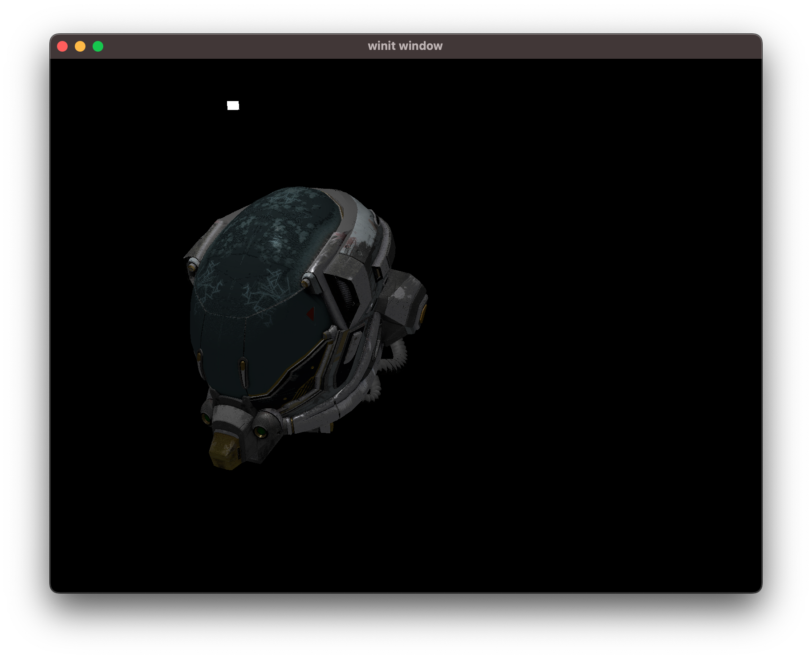
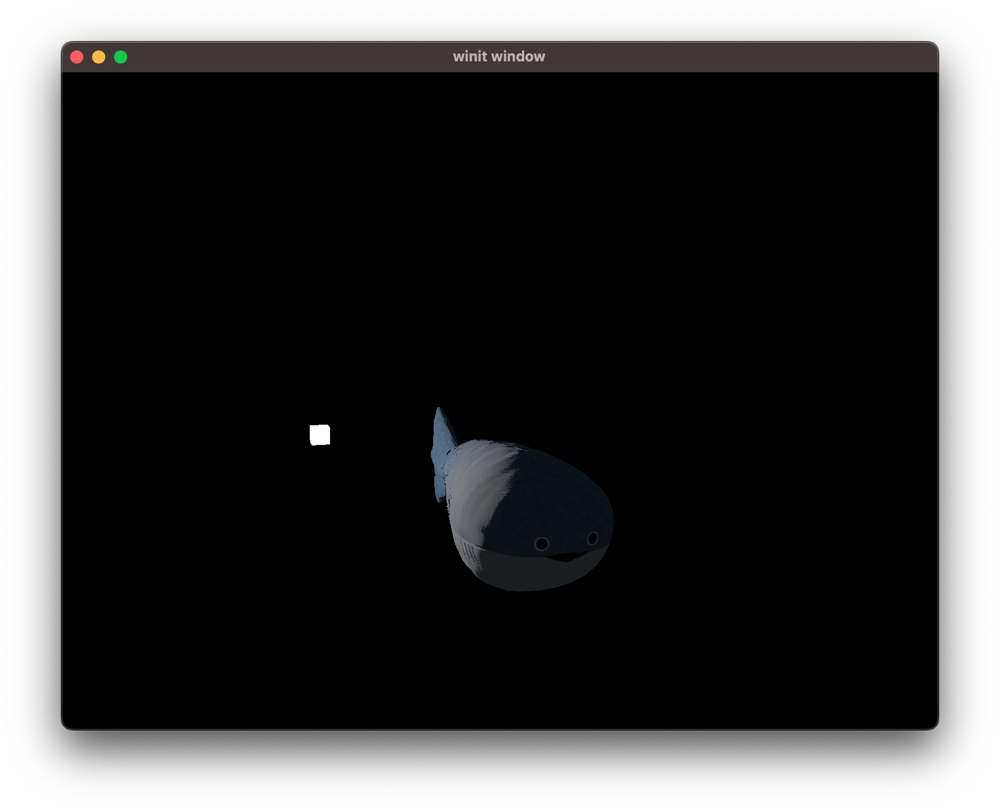

### Strike the Earth rustcaeens!

This is a graphic testing field like [SaschaWillems/Vulkan](https://github.com/SaschaWillems/Vulkan), but powered with wgpu.

There is a gltf loader based on [goth-gltf](https://github.com/expenses/goth-gltf) (I forked it with some tweaks), it can be a standalone crate in the future.

**Please note that this project is still in early development, some code is rather rough.**

### Showcases:

### TODO
- [x] gltf
- [x] indirect draw
- [x] deferred rendering
- [x] pbr
- [ ] shadow
- [ ] ibl

### Why this name?
I was playing [Dwarf fortress](https://store.steampowered.com/app/975370/Dwarf_Fortress/) at the time, so a name just came up with one letter diff.